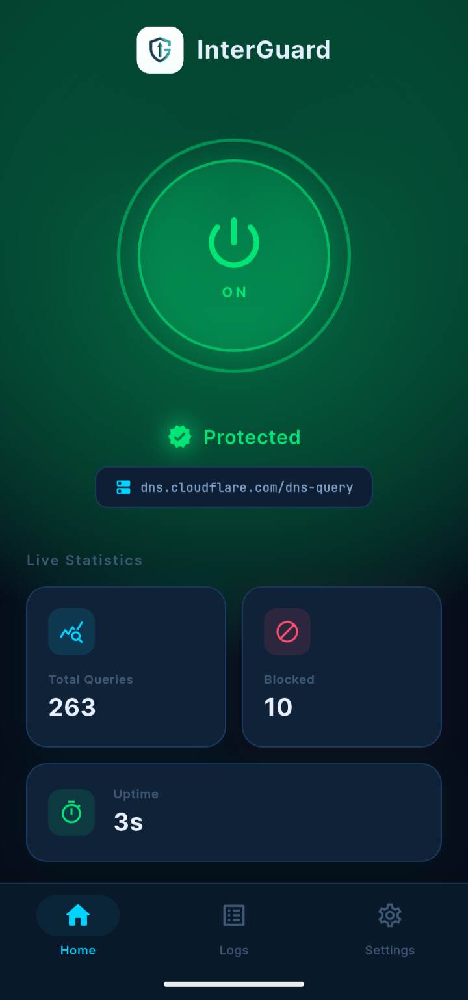
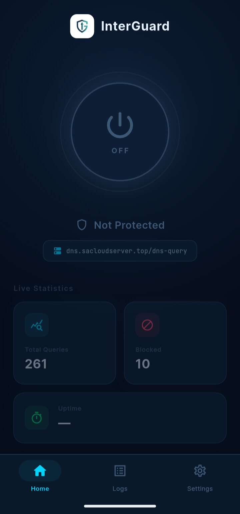
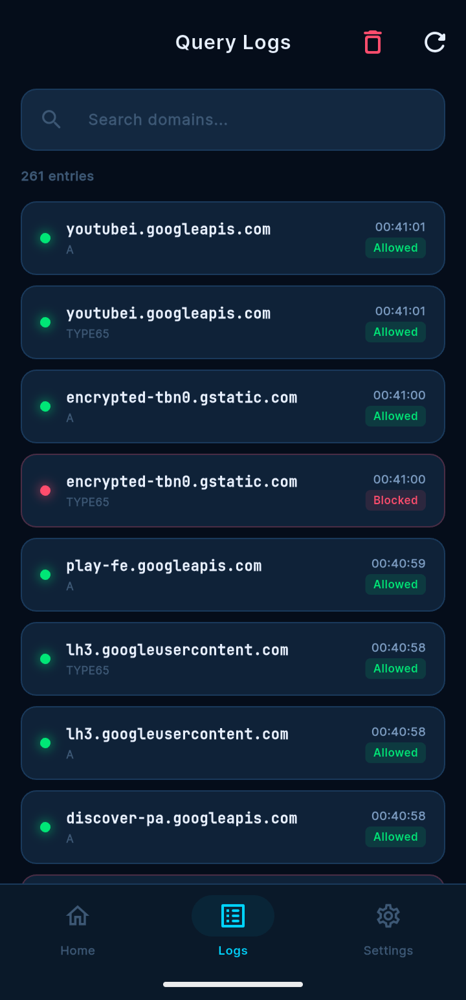
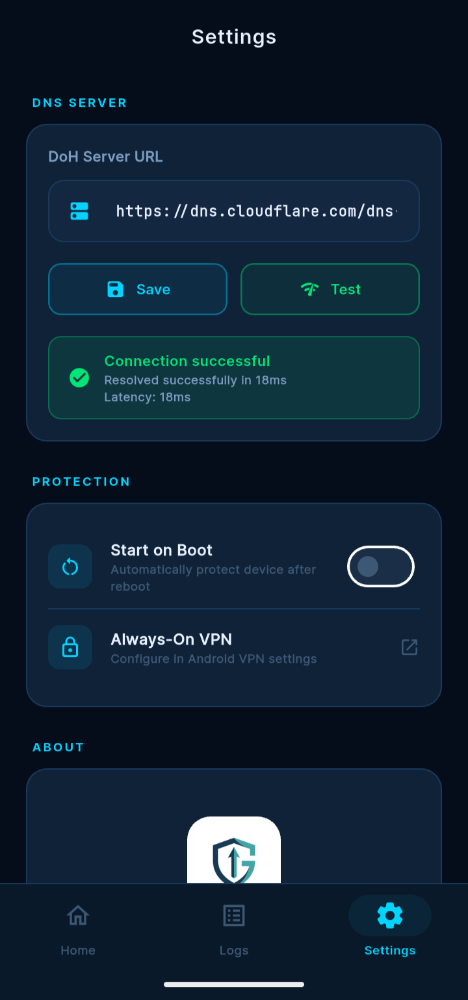

<div align="center">


# InterGuard

### Block your ads by DNS

[](https://github.com/sakib134452/InterGuard/releases/latest)
[](LICENSE)
[](https://github.com/sakib134452/InterGuard/releases/latest/download/InterGuard.apk)
[](https://flutter.dev)

**InterGuard** is a free, open-source DNS-over-HTTPS client for Android.  
It blocks ads, trackers, and malicious domains **system-wide** — across every app — without root.

[⬇️ Download APK](https://github.com/sakib134452/InterGuard/releases/latest/download/InterGuard.apk) · [🌐 Website](https://interguard.vercel.app) · [📋 Releases](https://github.com/sakib134452/InterGuard/releases)

</div>

---

## 📱 Screenshots

| Splash | Home (ON) | Home (OFF) | Logs | Settings |
|--------|-----------|------------|------|----------|
| ) |  |  |  |  |

---

## ✨ Features

- 🛡️ **System-wide ad blocking** — blocks ads in every app, not just browsers
- 🔒 **DNS-over-HTTPS (DoH)** — encrypted DNS queries, ISP can't snoop
- 🏠 **Self-hosted DNS support** — connect to your own AdGuard Home or any DoH server
- 📊 **Live query logs** — see every DNS request in real-time, search & filter
- ⚡ **No root required** — uses Android's built-in VPN API
- 🔄 **Auto-start on boot** — always protected after reboot
- 🌐 **Network switching** — seamlessly handles WiFi ↔ Mobile data switching
- 📱 **Clean minimal UI** — dark midnight blue design with cyan accents

---

## 📥 Installation

### Android
1. Download the latest APK from [Releases](https://github.com/sakib134452/InterGuard/releases/latest/download/InterGuard.apk)
2. Enable **Install from unknown sources** in Android settings
3. Install and open InterGuard
4. change your name or keep default.
5. Tap the power button to start protection

### Setup your own DoH server
1. Go to **Settings** tab
2. Enter your DoH URL (e.g. `https://your-adguard.domain/dns-query`)
3. Tap **Test** to verify connection
4. Tap **Save** — done!

---

## 🏗️ How It Works

```
Your App
    ↓ DNS Query (UDP port 53)
InterGuard VPN (local tunnel)
    ↓ DNS-over-HTTPS (RFC 8484)
Your DoH Server (AdGuard Home / Cloudflare / etc.)
    ↓ Blocked? → NXDOMAIN returned
    ↓ Allowed? → Real IP returned
Your App gets the answer
```

InterGuard creates a local VPN tunnel using Android's `VpnService` API. It intercepts DNS queries, forwards them encrypted to your chosen DoH server, and returns the response. All non-DNS traffic bypasses the tunnel completely — so your internet speed is unaffected.

---

## 🛠️ Tech Stack

| Layer | Technology |
|-------|-----------|
| UI | Flutter (Dart) |
| VPN Engine | Native Android Java (`VpnService`) |
| DNS Parsing | Custom Java DNS packet parser |
| DoH Forwarding | `HttpURLConnection` (RFC 8484) |
| State Management | Flutter Provider |
| Bridge | Flutter Method Channels + Event Channels |

---

## 🔨 Build from Source

**Requirements:**
- Flutter SDK (latest stable)
- Android Studio
- Android SDK 24+
- Java 11+

```bash
# Clone the repo
git clone https://github.com/sakib134452/InterGuard.git
cd InterGuard

# Install dependencies
flutter pub get

# Run on device
flutter run

# Build release APK
flutter build apk --release
```

---

## 🤝 Contributing

Contributions are welcome! Feel free to:
- 🐛 Report bugs via [Issues](https://github.com/sakib134452/InterGuard/issues)
- 💡 Suggest features
- 🔧 Submit pull requests

---

## 📄 License

This project is licensed under the **Apache 2.0 License** — see the [LICENSE](LICENSE) file for details.

---

<div align="center">

Made with ❤️ · Free & Open Source Forever

⭐ Star this repo if InterGuard helped you!

</div>
